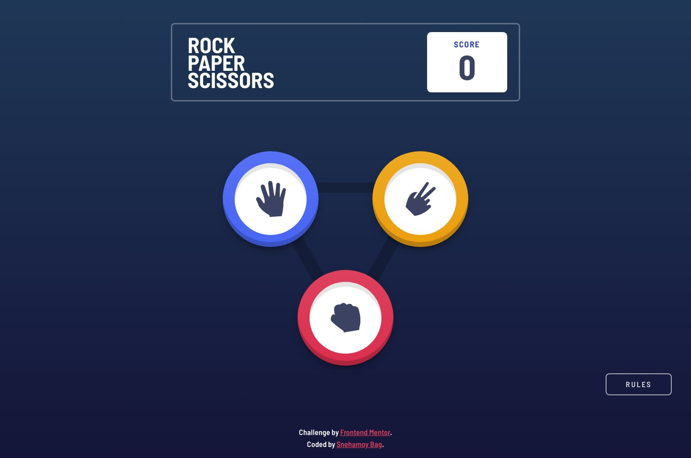
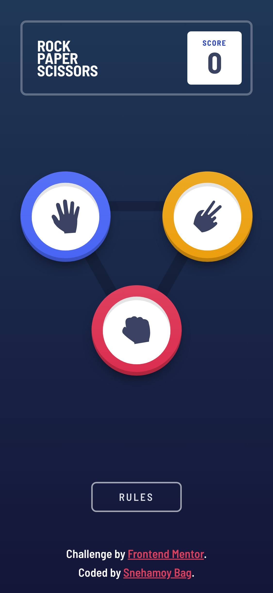

# Frontend Mentor - Rock, Paper, Scissors solution

This is a solution to the [Rock, Paper, Scissors challenge on Frontend Mentor](https://www.frontendmentor.io/challenges/rock-paper-scissors-game-pTgwgvgH). Frontend Mentor challenges help you improve your coding skills by building realistic projects.

## Table of contents

- [Overview](#overview)
- [The challenge](#the-challenge)
- [Screenshot](#screenshot)
- [Links](#links)
- [My process](#my-process)
- [Built with](#built-with)
- [What I learned](#what-i-learned)
- [Continued development](#continued-development)
- [Useful resources](#useful-resources)
- [Author](#author)
- [Acknowledgments](#acknowledgments)

## Overview

### The challenge

Users should be able to:

- View the optimal layout for the game depending on their device's screen size
- Play Rock, Paper, Scissors against the computer
- Maintain the state of the score after refreshing the browser _(optional)_
- **Bonus**: Play Rock, Paper, Scissors, Lizard, Spock against the computer _(optional)_

### Screenshot

### Links

- Solution URL: [View](https://github.com/snehamoybag/rock-paper-scissor-lizard-spock)
- Live Site URL: [View](https://snehamoybag.github.io/rock-paper-scissor-lizard-spock)

## My process

### Built with

- Semantic HTML5 markup
- BEM naming conventions
- CSS custom properties
- Flexbox
- CSS Grid
- Mobile-first workflow
- [Vite](vitejs.dev) - Vite Package bundler
- [SASS/SCSS](https://sass-lang.com) - For better css organisations

### What I learned

A great challenge that made me brush off my animations and layout skills a little more.
Game logic itself is very simple and easy to build. However, the layout and animations are some different gravy!
Wanted to add some movements with some animations, and boy.. ended up making my life way harder than it should've been.
Took me few trials and errors to get things right, well atleaset the way I wanted. For now, I am happy with the results!

### Continued development

As of now, I've only done the 'Rock, Paper and Scissors' part of the challenge, but I've left everything setup for the bonus challenge.
Will definitely finish in near future.

### Useful resources

- [CSS Animations](https://developer.mozilla.org/en-US/docs/Web/CSS/animation)
- [animationend EventListener](https://developer.mozilla.org/en-US/docs/Web/API/Element/animationend_event)

## Author

- Github - [@snehamoybag](https://github.com/snehamoybag)
- LinkedIn - [Snehamoy Bag](https://www.linkedin.com/mwlite/in/snehamoy-bag-a83509238)
- Frontend Mentor - [@snehamoybag](https://www.frontendmentor.io/profile/snehamoybag)

## Acknowledgments

Although I've coded everything from scratch, the animations styles are heavily inspired by our fellow FEM member [lieneil](https://www.frontendmentor.io/solutions/rock-paper-scissor-lizard-spock-OqBM3Ujnf7). Huge Shoutout to [lieneil](https://www.frontendmentor.io/profile/NJVS) !!